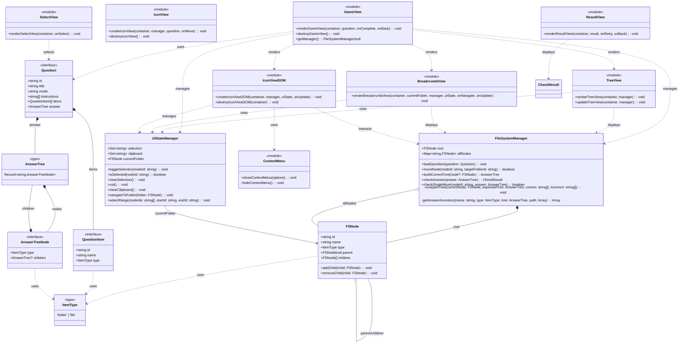

# folder-structure-trainer

フォルダ構造を学ぶためのインタラクティブなトレーニングアプリケーション

## アーキテクチャ

### クラス図

### 主要コンポーネント

#### モデル層

- **FSNode**: ファイルシステムのノードを表現。親子関係を管理し、ツリー構造を構築
- **FileSystemManager**: ファイルシステムの状態管理、ノードの移動、正誤判定を担当
- **UIStateManager**: UI状態管理（選択、クリップボード、現在フォルダ）。データ層とUI層を分離
- **Question**: 問題データの定義（アイテム、指示、正解ツリーを含む）
- **AnswerTree**: 正解のフォルダ構造を明示的な型フィールドで表現

#### ビュー層

- **GameView**: ゲーム画面全体を管理
- **BreadcrumbView**: パンくずリストでナビゲーション
- **TreeView**: フォルダ構造のツリー表示（ドロップ先として機能）
- **IconViewDOM**: DOM ベースのアイコンビュー（ドラッグ&ドロップ、複数選択対応）
- **ContextMenu**: 右クリックメニュー（切り取り、貼り付け）
- **SelectView**: 問題選択画面
- **ResultView**: 答え合わせ結果の表示

## 実装されている機能

Windows エクスプローラーの操作を模倣した以下の機能を実装：

### ドラッグ&ドロップ

- アイテムをフォルダにドラッグ&ドロップで移動
- TreeView のフォルダにドロップ可能
- BreadcrumbView（パンくずリスト）の各階層にドロップ可能
- 複数選択したアイテムをまとめてドロップ
- ドラッグ中は半透明プレビューを表示

### 選択操作

- **クリック**: 単一選択
- **Ctrl+クリック**: 複数選択（トグル）
- **Shift+クリック**: 範囲選択
- **空白クリック**: 選択を解除

### 右クリックメニュー

- **切り取り**: 選択したアイテムをクリップボードに
- **貼り付け**: クリップボードのアイテムをフォルダに移動
- アイテム上 / 空白エリアで異なるメニュー表示

### キーボードショートカット

- **Ctrl+X / Cmd+X**: 切り取り
- **Ctrl+V / Cmd+V**: 貼り付け

### ナビゲーション

- **ダブルクリック**: フォルダを開く
- **パンくずリスト**: クリックで階層を移動

### アクセシビリティ対応

- ARIA 属性によるスクリーンリーダー対応
- キーボード操作対応
- フォーカス表示

## アクセシビリティ

- **フォント:** BIZ UDPゴシック（ユニバーサルデザイン）
- **基本サイズ:** 24px

### 文字を拡大したい場合

ブラウザのズーム機能を使用してください：

- **Windows/Linux:** `Ctrl` + `+` で拡大、`Ctrl` + `-` で縮小
- **macOS:** `Cmd` + `+` で拡大、`Cmd` + `-` で縮小
- **リセット:** `Ctrl/Cmd` + `0`
