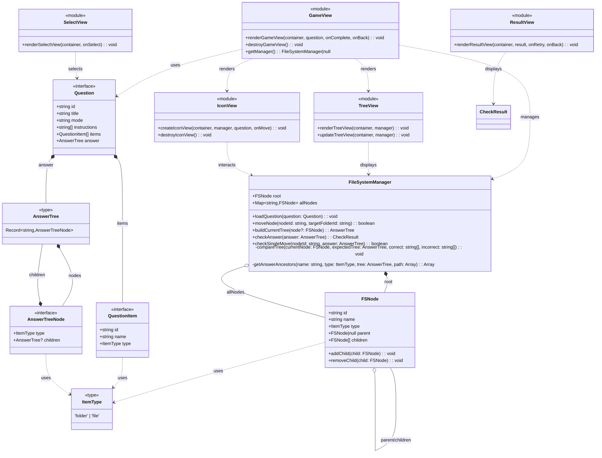

# folder-structure-trainer

フォルダ構造を学ぶためのインタラクティブなトレーニングアプリケーション

## アーキテクチャ

### クラス図

### 主要コンポーネント

#### モデル層

- **FSNode**: ファイルシステムのノードを表現。親子関係を管理し、ツリー構造を構築
- **FileSystemManager**: ファイルシステムの状態管理、ノードの移動、正誤判定を担当
- **Question**: 問題データの定義（アイテム、指示、正解ツリーを含む）
- **AnswerTree**: 正解のフォルダ構造を明示的な型フィールドで表現

#### ビュー層

- **GameView**: ゲーム画面全体を管理
- **TreeView**: フォルダ構造のツリー表示
- **IconView**: ドラッグ可能なアイテムアイコンの表示
- **SelectView**: 問題選択画面
- **ResultView**: 答え合わせ結果の表示

## アクセシビリティ

- **フォント:** BIZ UDPゴシック（ユニバーサルデザイン）
- **基本サイズ:** 24px

### 文字を拡大したい場合

ブラウザのズーム機能を使用してください：

- **Windows/Linux:** `Ctrl` + `+` で拡大、`Ctrl` + `-` で縮小
- **macOS:** `Cmd` + `+` で拡大、`Cmd` + `-` で縮小
- **リセット:** `Ctrl/Cmd` + `0`
