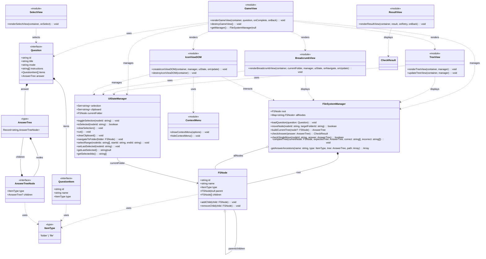

# アーキテクチャ

## クラス図



## 主要コンポーネント

### モデル層

- **FSNode**: ファイルシステムのノードを表現。親子関係を管理し、ツリー構造を構築
- **FileSystemManager**: ファイルシステムの状態管理、ノードの移動、正誤判定を担当
- **UIStateManager**: UI状態管理（選択、クリップボード、現在フォルダ）。データ層とUI層を分離
- **Question**: 問題データの定義（アイテム、指示、正解ツリーを含む）
- **AnswerTree**: 正解のフォルダ構造を明示的な型フィールドで表現

### ビュー層

- **GameView**: ゲーム画面全体を管理
- **BreadcrumbView**: パンくずリストでナビゲーション
- **TreeView**: フォルダ構造のツリー表示（ドロップ先として機能）
- **IconViewDOM**: DOM ベースのアイコンビュー（ドラッグ&ドロップ、複数選択、キーボードショートカット対応）
- **ContextMenu**: 右クリックメニュー（切り取り、貼り付け）
- **SelectView**: 問題選択画面
- **ResultView**: 答え合わせ結果の表示

## フォーカス管理戦略（IconViewDOM）

キーボードショートカット（Ctrl+X / Cmd+X、Ctrl+V / Cmd+V）を機能させるため、IconViewDOM はフォーカス管理を実装しています。

### 問題：なぜフォーカス管理が必要なのか

キーボードイベント（キーを押したという情報）は、**フォーカスされている要素**（現在選択されている要素）でしか受け取れません。フォーカスがどこにもない状態では、キーボードショートカットは機能しません。

例えば、ブラウザで Tab キーを押すと、入力欄やボタンなどが順番に選択されていきます。この「選択されている状態」がフォーカスです。

### 基本原則

1. **コンテナを常にフォーカス可能に**
   - **理由**: 空のフォルダでは、中にアイテムが何もないため、フォーカスできる要素がありません。その状態でもキーボードショートカットを使えるように、コンテナ（アイテムを入れる箱）自体をフォーカス可能にします。
   - **実装**: `container.tabIndex = 0` で、コンテナがキーボード操作で選択できるようになります。

2. **クリック時にフォーカスを移動**
   - **理由**: アイテムをクリックしたとき、自動的にそのアイテムにフォーカスが移らない場合があります。フォーカスがないとキーボードショートカットが使えないため、クリック時に明示的にフォーカスを移します。
   - **実装**: アイテムクリック時に `div.focus()` を呼び出してフォーカスを移動します。

3. **DOM再描画時にフォーカスを保持**
   - **理由**: フォルダを開いたり、アイテムを移動したりすると、画面が再描画（作り直し）されます。このとき、フォーカスが失われてしまい、キーボードショートカットが使えなくなります。
   - **実装**: 再描画前にフォーカスされていたアイテムのID（`data-node-id`：各アイテムに付けた識別番号）を記憶しておき、再描画後に同じIDのアイテムを見つけて、再びフォーカスを当てます。

4. **フォールバック（失敗時の対応）**
   - **理由**: パンくずリストからフォルダを開いたときなど、以前フォーカスされていたアイテムが新しいフォルダに存在しない場合があります。そのときにフォーカスが完全に失われると、キーボードショートカットが使えなくなります。
   - **実装**: フォーカス復元に失敗した場合は、常にコンテナにフォーカスを当てます。これにより、どんな状況でもキーボードショートカットが使えるようになります。

### 実装詳細

#### createIconViewDOM（初期化処理）

この関数は、アイコンビューを作成するときに最初に呼ばれます。

```typescript
export function createIconViewDOM(
  container: HTMLElement,
  manager: FileSystemManager,
  uiState: UIStateManager,
  onUpdate: () => void
): void {
  // コンテナをフォーカス可能にする（tabIndex = 0 で Tab キーで選択できるようになる）
  container.tabIndex = 0

  renderIconViewDOM(container, manager, uiState, onUpdate)
  setupKeyboardShortcuts(container, manager, uiState, onUpdate)
  setupContextMenuForEmptyArea(container, uiState, manager, onUpdate)
  setupEmptyAreaClick(container, uiState, onUpdate)
}
```

**ポイント**: `tabIndex = 0` を設定することで、コンテナ（アイテムを表示する領域）自体がフォーカスできるようになります。これにより、空のフォルダでもキーボードショートカットが使えます。

#### renderIconViewDOM（画面の再描画とフォーカス保持）

この関数は、フォルダを開いたり、アイテムを移動したりして画面を更新するたびに呼ばれます。

```typescript
function renderIconViewDOM(
  container: HTMLElement,
  manager: FileSystemManager,
  uiState: UIStateManager,
  onUpdate: () => void
): void {
  // 1. 現在フォーカスされている要素のIDを記憶する
  //    document.activeElement: 今フォーカスされている要素
  //    dataset.nodeId: その要素に付けられた識別番号
  const activeElement = document.activeElement as HTMLElement
  const focusedNodeId = activeElement?.dataset?.nodeId

  // 2. 画面を作り直す（古い要素を削除して、新しい要素を作る）
  container.innerHTML = ''
  container.className = 'icon-view-dom'
  const items = uiState.currentFolder.children
  items.forEach(node => {
    const itemEl = createIconItem(node, uiState, manager, onUpdate)
    container.appendChild(itemEl)
  })

  // 3. 記憶していたIDと同じアイテムがあれば、そこにフォーカスを戻す
  if (focusedNodeId) {
    const itemToFocus = container.querySelector<HTMLElement>(`[data-node-id="${focusedNodeId}"]`)
    if (itemToFocus) {
      itemToFocus.focus()
      return // 復元成功したので、ここで終了
    }
  }

  // 4. 同じアイテムが見つからなかった場合の対応
  //    コンテナにフォーカスを当てることで、キーボードショートカットが使えるようにする
  container.focus()
}
```

**ポイント**: 画面を作り直す前に「どこにフォーカスがあったか」を覚えておき、作り直した後で同じ場所にフォーカスを戻します。戻せなかった場合は、コンテナにフォーカスを当てて、キーボード操作ができるようにします。

### キーボードイベントの伝播（イベントが親要素に伝わる仕組み）

キーボードを押したとき、そのイベント（キーが押されたという情報）は以下のように伝わります：

1. **キーイベント発生**: フォーカスされている要素（アイテムまたはコンテナ）でキーが押される
2. **親要素に伝わる**: イベントが親要素（コンテナ）に「バブリング」（泡のように浮き上がる）して伝わる
3. **ショートカット実行**: コンテナに設定されたキーボードショートカット処理が実行される

**具体例**: アイテム A にフォーカスがあるときに Ctrl+X / Cmd+X を押すと、

- アイテム A でキーイベント発生 → コンテナに伝わる → コンテナが「切り取り」処理を実行

この仕組みのおかげで：

- どのアイテムにフォーカスがあっても
- 空のフォルダでコンテナにフォーカスがあっても
- 常にキーボードショートカットが機能します

### テストカバレッジ

以下のシナリオをテストでカバーしています：

- アイテムクリック時のフォーカス移動
- DOM再描画後のフォーカス保持
- 空のフォルダでのコンテナフォーカス
- 各ナビゲーション方法（アイコンパネル、パンくずリスト）でのフォーカス確保
- 選択あり/なしでのキーボードショートカット動作
